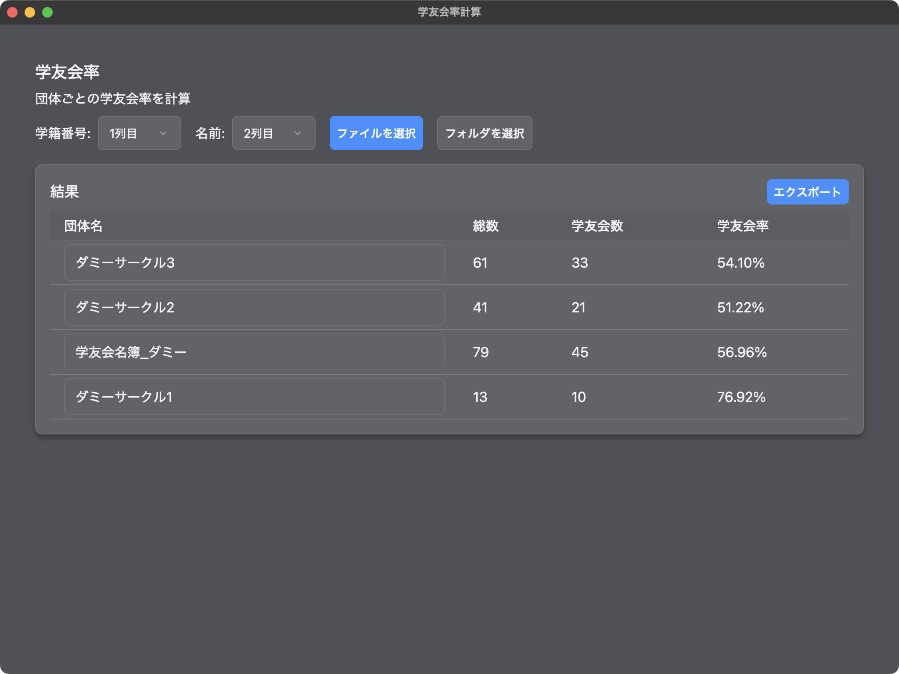

# 学友会率計算アプリ

このアプリは、学友会の参加率を簡単に計算するためのデスクトップアプリケーションです。

## 使用方法

[test](./test) フォルダには、試用できるダミーデータが含まれています。

```
test
├── ダミーサークル1.xlsx
├── ダミーサークル2.xlsx
├── ダミーサークル3.xlsx
└── 学友会名簿_ダミー.xlsx
```

### アプリの利用手順

1. アプリを起動したら、「ファイルを選択」ボタンをクリックし、学友会名簿ファイルを選択します。使用できるファイル形式は `xlsx` または `xls` のみです。

2. 学友会名簿には、学籍番号および学友会参加状況（TRUE | FALSE）が記載された列が必要です。参加状況が TRUE | FALSE で記載されていない場合、Excelで以下のような関数を使用して変換してください：

   ```
   =IF(C2="○",TRUE,FALSE)
   ```

   

3. 読み込んだ名簿データから学籍番号と学友会参加状況の列を選択します。対象の列をクリックするか、下のプルダウンから列番号を選択してください。

   

4. 学友会名簿の概要画面で、データが正しく読み込まれているか確認します。団体の学友会率を計算するには、「学籍番号」と「名前」の列番号をプルダウンで選択し、「ファイルを選択」または「フォルダを選択」から対象のファイルやフォルダを指定します。

   - フォルダを一括選択する場合、学籍番号と名前の列の位置が全てのファイルで一致している必要があります。
   - すべてのファイルは、1枚目のシートにデータが保存されている必要があります。
   - 左上の「更新」ボタンで、新しい学友会名簿に更新可能です。

   

5. 団体名はファイル名から、総数は学籍番号列の7桁の数字の数から、学友会数は名簿と一致する学籍番号の数で決定されます。学友会率は `学友会数/総数` で計算します。

6. 「エクスポート」ボタンで結果をExcelファイルに出力できます。団体名はこの画面で直接編集可能です。

   


## 開発環境

- OS: MacOS (バージョン 15.4.1)
- Node.js:  (バージョン v22.15.0)
- RustとCargo: (Cargo バージョン 1.86.0)

##  開発

1. リポジトリをクローンします：

   ```bash
   git clone git@github.com:epitaq/gakuyukai-gui.git
   cd gakuyukai-gui
   ```

2. 依存関係をインストールします：

   ```bash
   npm install
   ```

### 開発サーバーの起動

開発モードでアプリを起動するには、以下のコマンドを実行します：

```bash
npm run tauri dev
```


### ビルド

リリース用のビルドを作成するには、以下のコマンドを実行します：

```bash
npm run tauri build
```

ビルドされたアプリは `src-tauri/target/release` に生成されます。